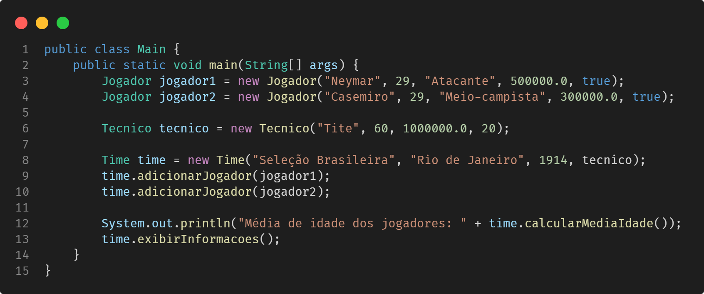

# Projeto Java: Sistema de gerenciamento de times de futebol

## 1. Classes

### Jogador

- **Atributos**: nome (`String`), idade (`int`), posicao (`String`), salario (`float`), contratado (`boolean`).
- **Métodos**: construtores (com e sem parâmetros), métodos `get` e `set` para todos os atributos com validações apropriadas (por exemplo, idade não pode ser negativa, salário não pode ser negativo etc.).

### Tecnico

- **Atributos**: nome (`String`), idade (`int`), salario (`float`), anosExperiencia (`int`).
- **Métodos**: construtores (com e sem parâmetros), métodos `get` e `set` para todos os atributos com validações apropriadas.

### Time

- **Atributos**: nome (`String`), cidade (`String`), anoFundacao (`int`), listaJogadores (`ArrayList<Jogador>`), tecnicoResponsavel (`Tecnico`).
- **Métodos**: construtores (com e sem parâmetros), métodos `get` e `set` para todos os atributos com validações apropriadas. Método para adicionar jogador à lista de jogadores do time.

## 2. Requisitos

Faça **validações**, garantindo que:

- a idade dos jogadores e do técnico seja maior que zero;
- o salário não seja negativo para jogadores e técnicos;
- o ano de fundação do time seja um valor válido (por exemplo, não pode ser um ano futuro).

## 3. Funcionalidades

- Crie um método na classe **Time** para calcular a média de idade dos jogadores do time.
- Implemente um método na classe **Time** para exibir todas as informações do time, incluindo o nome, cidade, ano de fundação, informações do técnico e a lista de jogadores.

## 4. Exemplo de uso

[Voltar](../README.md)
