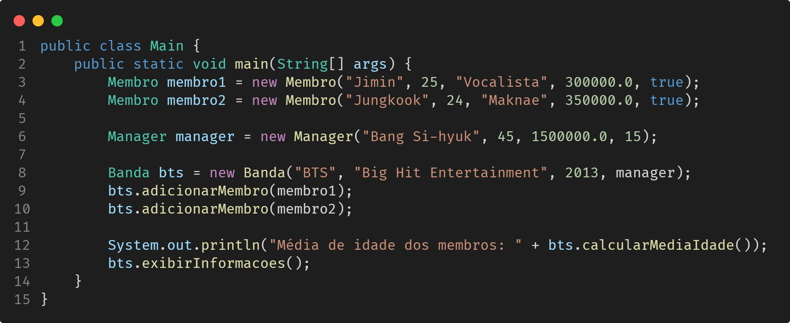

# Projeto Java: Sistema de gerenciamento de bandas de K-pop

## 1. Classes

### Membro

- **Atributos**: nome (`String`), idade (`int`), cargo (`String`), salario (`float`), statusContrato (`boolean`).
- **Métodos**: construtores (com e sem parâmetros), métodos `get` e `set` para todos os atributos com validações apropriadas (por exemplo, idade não pode ser negativa, salário não pode ser negativo etc.).

### Manager

- **Atributos**: nome (`String`), idade (`int`), salario (`float`), anosExperiencia (`int`).
- **Métodos**: construtores (com e sem parâmetros), métodos `get` e `set` para todos os atributos com validações apropriadas.

### Banda

- **Atributos**: nome (`String`), agencia (`String`), anoDeEstreia (`int`), listaMembros (`ArrayList<Membro>`), managerResponsavel (`Manager`).
- **Métodos**: construtores (com e sem parâmetros), métodos `get` e `set` para todos os atributos com validações apropriadas. Método para adicionar membro à lista de membros da banda.

## 2. Requisitos

Faça **validações**, garantindo que:

- a idade dos membros e do manager seja maior que zero.
- o salário não pode ser negativo para membros e managers.
- o ano de estreia da banda seja um valor válido (por exemplo, não pode ser um ano futuro).

## 3. Funcionalidades

- Crie um método na classe **Banda** para calcular a média de idade dos membros da banda.
- Implemente um método na classe **Banda** para exibir todas as informações da banda, incluindo o nome, agência, ano de estreia, informações do manager e a lista de membros.

## 4. Exemplo de uso

[Voltar](../README.md)
