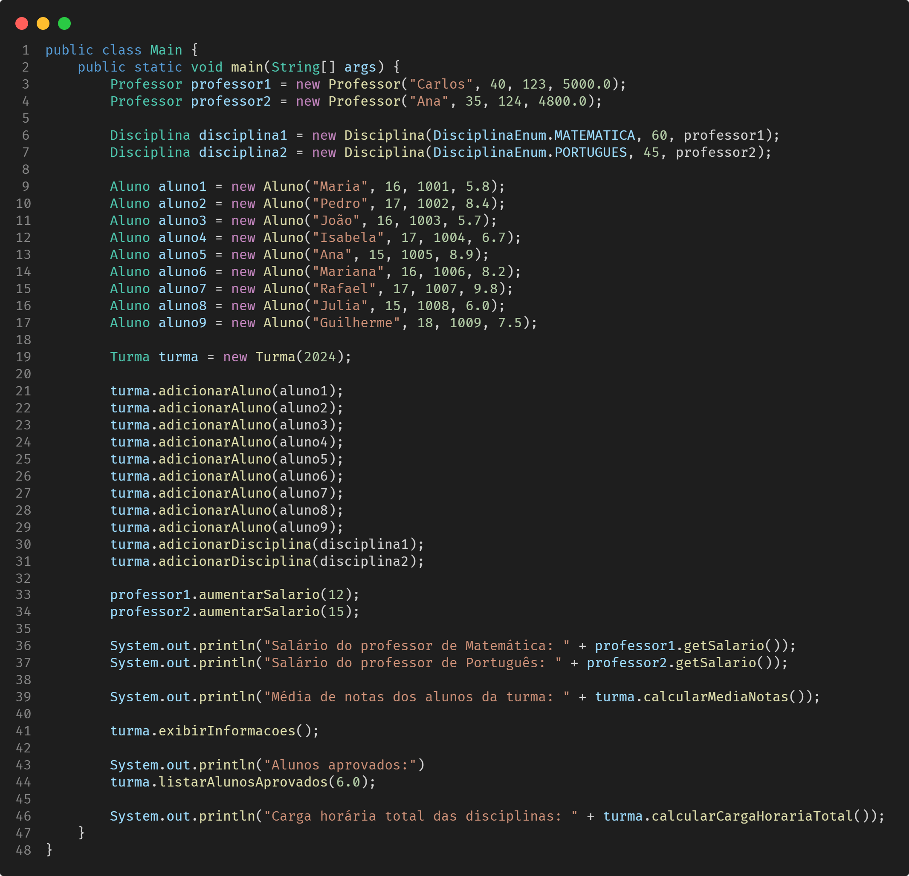

# Projeto Java: Sistema de gerenciamento escolar

## 1. Descrição

Este projeto tem como objetivo a criação de um sistema de gerenciamento escolar em Java, abrangendo as principais entidades presentes em um ambiente educacional. Suas classes fundamentais englobam representações para Alunos, Professores, Disciplinas e Turmas, proporcionando uma estrutura coesa para a organização e manipulação de informações acadêmicas.

A implementação não se limita apenas à modelagem das classes, mas também prioriza a entrega de um conjunto de funcionalidades que enriquecem e aprimoram o sistema como um todo.

## 2. Classes

### Pessoa

- **Atributos**:
  - `nome`: String
  - `idade`: Integer
- **Métodos**: construtores (com e sem parâmetros), métodos `get` e `set` para todos os atributos.

### Aluno (herda de Pessoa)

- **Atributos**:
  - `matricula`: Integer
  - `serie`: Integer
  - `media`: Float
- **Métodos**: construtores (com e sem parâmetros), métodos `get` e `set` para todos os atributos.

### Professor (herda de Pessoa)

- **Atributos**:
  - `codigo`: Integer
  - `salario`: Double
- **Métodos**: construtores (com e sem parâmetros), métodos `get` e `set` para todos os atributos.

### Disciplina

- **Atributos**:
  - `nome`: DisciplinaEnum
  - `cargaHoraria`: Integer
  - `professorResponsavel`: Professor
- **Métodos**: construtores (com e sem parâmetros), métodos `get` e `set` para todos os atributos.

### Turma

- **Atributos**:
  - `anoLetivo`: Integer
  - `alunos`: List\<Aluno\>
  - `disciplinasOfertadas`: List\<Disciplina\>
- **Métodos**: construtores (com e sem parâmetros), métodos `get` e `set` para todos os atributos.

## 3. Enums

### DisciplinaEnum

**Valores**: `MATEMATICA`, `PORTUGUES`, `CIENCIAS`, `HISTORIA`, `GEOGRAFIA`, `INGLES`, `FISICA`, `QUIMICA`, `ARTES`, `EDUCACAO_FISICA`.

## 4. Requisitos

Faça **validações**, garantindo que:

- A idade de alunos e professores seja maior que zero.
- O salário não seja negativo para professores.
- A carga horária das disciplinas seja positiva.
- O ano letivo da turma seja um valor válido (por exemplo, não pode ser um ano futuro).
- A matrícula dos alunos seja única dentro de uma turma.
- A porcentagem aceita para aumento salarial do professor deve ser de 1 a 60%.

> **Dicas**
>
> - Faça as validações **antes** de atribuir os valores nos atributos!
> - Adapte os métodos existentes ou crie novos métodos para atender a esses requisitos adicionais.

## 5. Funcionalidades

- Crie um método na classe **Professor** para aumentar o salário, considerando o salário atual e uma bonificação (porcentagem representada por um inteiro) passada por parâmetro para o método (1~60%).
- Crie um método na classe **Turma** para calcular a média de notas dos alunos da turma.
- Implemente um método na classe **Turma** para exibir todas as informações da turma, incluindo o ano letivo, a lista de alunos e as disciplinas ofertadas.
- Implemente um método na classe **Turma** para adicionar um aluno à turma.
- Implemente um método na classe **Turma** para adicionar uma disciplina à turma.
- Implemente um método na classe **Turma** para listar os alunos aprovados, considerando uma média mínima para aprovação. Essa média mínima deve ser um parâmetro configurável.
- Desenvolva um método na classe **Turma** para calcular a carga horária total das disciplinas oferecidas.

## 6. Exemplo de uso

[Voltar](../README.md)
