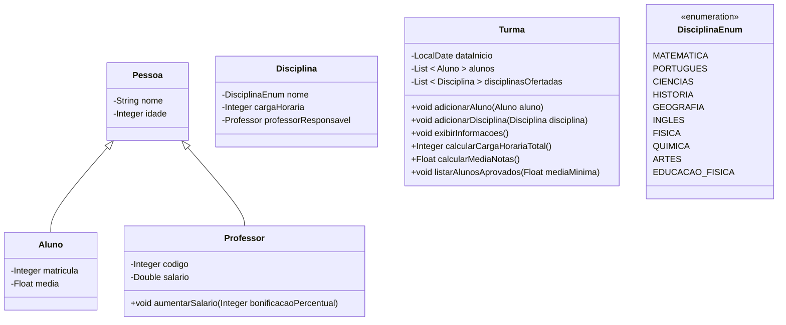

# Projeto Java: Sistema de gerenciamento escolar

[Voltar](../../README.md)

## 1. Descrição

Este projeto tem como objetivo a criação de um sistema de gerenciamento escolar em Java, abrangendo as principais entidades presentes em um ambiente educacional. Suas classes fundamentais englobam representações para Alunos, Professores, Disciplinas e Turmas, proporcionando uma estrutura coesa para a organização e manipulação de informações acadêmicas.

A implementação não se limita apenas à modelagem das classes, mas também prioriza a entrega de um conjunto de funcionalidades que enriquecem e aprimoram o sistema como um todo.

## 2. Componentes



> Os construtores e métodos assessores foram omitidos no diagrama

## 3. Requisitos

Faça **validações**, garantindo que:

1. A idade de alunos e professores seja maior que zero.
1. O salário não seja negativo para professores.
1. A carga horária das disciplinas seja positiva.
1. A matrícula dos alunos seja única dentro de uma turma.
1. A porcentagem aceita para aumento salarial do professor deve ser de 1 a 60%.

> **Dicas**
>
> - Faça as validações **antes** de atribuir os valores nos atributos!
> - Adapte os métodos existentes ou crie novos métodos para atender a esses requisitos adicionais.

## 4. Funcionalidades

1. Implemente um método na classe **Professor** para aumentar o salário, considerando o salário atual e uma bonificação (porcentagem representada por um inteiro) passada por parâmetro para o método (1~60%).
1. Implemente um método na classe **Turma** para adicionar um aluno à turma.
1. Implemente um método na classe **Turma** para adicionar uma disciplina à turma.
1. Implemente um método na classe **Turma** para exibir todas as informações da turma, incluindo o ano letivo, a lista de alunos e as disciplinas ofertadas.
1. Implemente um método na classe **Turma** para calcular a carga horária total das disciplinas oferecidas.
1. Implemente um método na classe **Turma** para calcular a média de notas dos alunos da turma.
1. Implemente um método na classe **Turma** para listar os alunos aprovados, considerando uma média mínima para aprovação. Essa média mínima deve ser um parâmetro configurável.

## 5. Exemplo de uso

```java
public class Main {
    public static void main(String[] args) {
        Professor professor1 = new Professor("Carlos", 40, 123, 5000.0);
        Professor professor2 = new Professor("Ana", 35, 124, 4800.0);

        Disciplina disciplina1 = new Disciplina(DisciplinaEnum.MATEMATICA, 60, professor1);
        Disciplina disciplina2 = new Disciplina(DisciplinaEnum.PORTUGUES, 45, professor2);

        Aluno aluno1 = new Aluno("Maria", 16, 1001, 5.8);
        Aluno aluno2 = new Aluno("Pedro", 17, 1002, 8.4);
        Aluno aluno3 = new Aluno("João", 16, 1003, 5.7);
        Aluno aluno4 = new Aluno("Isabela", 17, 1004, 6.7);
        Aluno aluno5 = new Aluno("Ana", 15, 1005, 8.9);
        Aluno aluno6 = new Aluno("Mariana", 16, 1006, 8.2);
        Aluno aluno7 = new Aluno("Rafael", 17, 1007, 9.8);
        Aluno aluno8 = new Aluno("Julia", 15, 1008, 6.0);
        Aluno aluno9 = new Aluno("Guilherme", 18, 1009, 7.5);

        Turma turma = new Turma(LocalDate.now());

        turma.adicionarAluno(aluno1);
        turma.adicionarAluno(aluno2);
        turma.adicionarAluno(aluno3);
        turma.adicionarAluno(aluno4);
        turma.adicionarAluno(aluno5);
        turma.adicionarAluno(aluno6);
        turma.adicionarAluno(aluno7);
        turma.adicionarAluno(aluno8);
        turma.adicionarAluno(aluno9);
        turma.adicionarDisciplina(disciplina1);
        turma.adicionarDisciplina(disciplina2);

        professor1.aumentarSalario(12);
        professor2.aumentarSalario(15);

        System.out.println("Salário do professor de Matemática: " + professor1.getSalario());
        System.out.println("Salário do professor de Português: " + professor2.getSalario());

        System.out.println("Média de notas dos alunos da turma: " + turma.calcularMediaNotas());

        turma.exibirInformacoes();

        System.out.println("Alunos aprovados:");
        turma.listarAlunosAprovados(6.0);

        System.out.println("Carga horária total das disciplinas: " + turma.calcularCargaHorariaTotal());
    }
}
```

[Voltar](../../README.md)
