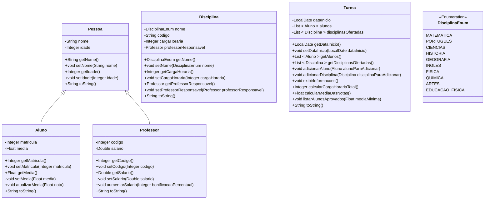

# Projeto Java: Sistema de gerenciamento escolar

O projeto visa desenvolver um sistema de gerenciamento escolar em Java, com classes para Alunos, Professores, Disciplinas e Turmas, focando na organização e manipulação eficiente de informações acadêmicas, com implementação de funcionalidades que agregam valor ao sistema.

[Voltar](../../README.md)

# Índice

<!-- TOC -->

- [1. Descrição](#1-descri%C3%A7%C3%A3o)
- [2. Componentes](#2-componentes)
- [3. Requisitos](#3-requisitos)
- [4. Funcionalidades](#4-funcionalidades)
- [5. Exemplo de uso](#5-exemplo-de-uso)

<!-- /TOC -->

## 1. Descrição

Este projeto tem como objetivo a criação de um sistema de gerenciamento escolar em Java, abrangendo as principais entidades presentes em um ambiente educacional. Suas classes fundamentais englobam representações para Alunos, Professores, Disciplinas e Turmas, proporcionando uma estrutura coesa para a organização e manipulação de informações acadêmicas.

A implementação não se limita apenas à modelagem das classes, mas também prioriza a entrega de um conjunto de funcionalidades que enriquecem e aprimoram o sistema como um todo.

## 2. Componentes



> Os construtores foram omitidos no diagrama. Verifique os códigos de exemplo para descobrir como são as assinaturas dos construtores de cada classe.

## 3. Requisitos

Faça **validações**, garantindo que:

1. A idade de alunos e professores seja maior que zero.
1. A média dos alunos não seja negativa e não ultrapasse o valor 10.
1. O salário não seja negativo para professores.
1. A carga horária das disciplinas seja positiva.
1. O professor responsável pela disciplina não seja nulo.
1. O código da disciplina não seja vazio e seja gravado com todas as letras em maiúsculo.

> **Dicas**
>
> - Faça as validações **antes** de atribuir os valores nos atributos!
> - Adapte os métodos existentes ou crie novos métodos para atender a esses requisitos adicionais.

## 4. Funcionalidades

1. Implemente um método na classe **Aluno** para atualizar a média, considerando a média atual e uma nota (positiva ou negativa) passada por parâmetro para o método.
1. Implemente um método na classe **Professor** para aumentar o salário, considerando o salário atual e um aumento percentual passado por parâmetro para o método (1~30%). Por exemplo: 15 para 15%.
1. Implemente um método na classe **Turma** para adicionar uma disciplina à turma.
1. Implemente um método na classe **Turma** para adicionar um aluno à turma. Atenção: a matrícula do aluno deve ser único dentro de uma turma.
1. Implemente um método na classe **Turma** para calcular a carga horária total das disciplinas oferecidas.
1. Implemente um método na classe **Turma** para calcular a média de notas dos alunos da turma.
1. Implemente um método na classe **Turma** para exibir todas as informações da turma, incluindo o ano letivo, a lista de alunos e as disciplinas ofertadas.
1. Implemente um método na classe **Turma** para listar os alunos aprovados, considerando uma média mínima para aprovação. Essa média mínima deve ser um parâmetro configurável.
1. Implemente um método `toString` para cada uma das classes: **Pessoa**, **Aluno**, **Professor**, **Disciplina** e **Turma**. Para classes que usam composição, o método `toString` deve chamar os métodos `toString` das classes referenciadas. Por exemplo, o `toString` da classe **Disciplina** deve chamar o `toString` da classe **Professor**.

## 5. Exemplo de uso

```java
public class Main {
    public static void main(String[] args) {
        Professor professor1 = new Professor("Carlos", 40, 123, 5000.0);
        Professor professor2 = new Professor("Ana", 35, 124, 4800.0);

        Disciplina disciplina1 = new Disciplina(DisciplinaEnum.MATEMATICA, "MAT123", 60, professor1);
        Disciplina disciplina2 = new Disciplina(DisciplinaEnum.PORTUGUES, "POR456", 45, professor2);

        Aluno aluno1 = new Aluno("Maria", 16, 1001, 5.8F);
        Aluno aluno2 = new Aluno("Pedro", 17, 1002, 8.4F);
        Aluno aluno3 = new Aluno("João", 16, 1003, 5.7F);
        Aluno aluno4 = new Aluno("Isabela", 17, 1004, 5.7F);
        Aluno aluno5 = new Aluno("Julia", 15, 1008, 9.1F);
        Aluno aluno6 = new Aluno("Guilherme", 18, 1009, 7.5F);

        Turma turma = new Turma(LocalDate.now());

        turma.adicionarAluno(aluno1);
        turma.adicionarAluno(aluno2);
        turma.adicionarAluno(aluno3);
        turma.adicionarAluno(aluno4);
        turma.adicionarAluno(aluno5);
        turma.adicionarAluno(aluno6);
        turma.adicionarDisciplina(disciplina1);
        turma.adicionarDisciplina(disciplina2);

        professor1.aumentarSalario(12);
        professor2.aumentarSalario(15);

        System.out.println("Salário do professor de Matemática: " + professor1.getSalario());
        System.out.println("Salário do professor de Português: " + professor2.getSalario());

        System.out.println("Média de notas dos alunos da turma: " + turma.calcularMediaDasNotas());

        turma.exibirInformacoes();

        aluno4.atualizarMedia(0.3);
        aluno2.atualizarMedia(-0.5);

        System.out.println("Alunos aprovados:");
        turma.listarAlunosAprovados(6.0);

        System.out.println("Carga horária total das disciplinas: " + turma.calcularCargaHorariaTotal());

        turma.exibirInformacoes();
    }
}
```

[Voltar](../../README.md)
