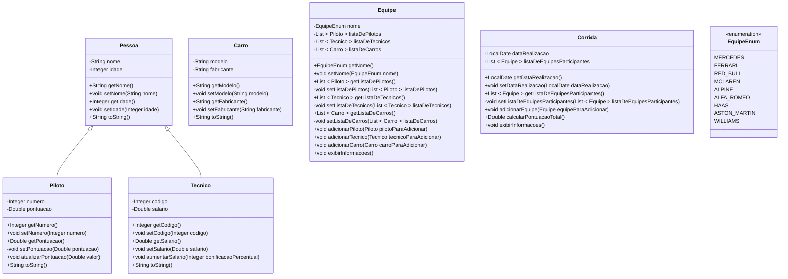

# Projeto Java: Sistema de gerenciamento de corrida automobilística

[Voltar](../../README.md)

## 1. Descrição

Este projeto tem como objetivo a criação de um sistema de gerenciamento de corrida automobilística em Java, abrangendo as principais entidades presentes em um ambiente de competição automotiva. Suas classes fundamentais englobam representações para Pilotos, Técnicos, Carros, Equipes e Corridas, proporcionando uma estrutura coesa para a organização e manipulação de informações relacionadas às corridas.

A implementação não se limita apenas à modelagem das classes, mas também prioriza a entrega de um conjunto de funcionalidades que enriquecem e aprimoram o sistema como um todo.

## 2. Componentes



> Os construtores foram omitidos no diagrama. Verifique os códigos de exemplo para descobrir como são as assinaturas dos construtores de cada classe.

> Procure usar a chamada dos métodos `set` dentro dos construtores em vez de atribuir os valores diretamente nos atributos.

## 3. Requisitos

Faça **validações**, garantindo que:

1. A idade dos pilotos e técnicos seja maior ou igual a 18.
1. A pontuação dos pilotos não seja negativa.
1. O salário dos técnicos da equipe seja positivo.
1. O modelo e o fabricante dos carros não sejam nulos ou vazios.
1. O modelo do carro seja gravado com todas as letras em maiúsculo.

> **Dicas**
>
> - Faça as validações **antes** de atribuir os valores nos atributos!
> - Adapte os métodos existentes ou crie novos métodos para atender a esses requisitos adicionais.

## 4. Funcionalidades

1. Implemente um método na classe **Piloto** para atualizar a pontuação, considerando a pontuação atual e uma pontuação (positiva ou negativa) passada por parâmetro para o método.
1. Implemente um método na classe **Tecnico** para aumentar o salário, considerando o salário atual e um aumento percentual passado por parâmetro para o método (1~30%). Por exemplo: 15 para 15%.
1. Implemente um método na classe **Equipe** para adicionar um técnico à equipe.
1. Implemente um método na classe **Equipe** para adicionar um carro à equipe.
1. Implemente um método na classe **Equipe** para adicionar um piloto à equipe. Atenção: o número do piloto deve ser único dentro de uma equipe.
1. Implemente um método na classe **Corrida** para adicionar uma equipe à corrida.
1. Implemente um método na classe **Corrida** para calcular a pontuação total de todas as equipes participantes.
1. Implemente o método `toString` para cada uma das classes: **Pessoa**, **Piloto**, **Tecnico**, **Carro**. As subclasses devem chamar os métodos `toString` da superclasse através do `super` para compor o seu `toString`.
1. Implemente um método na classe **Equipe** para exibir todas as informações da equipe. Esse método deve chamar os métodos `toString` das classes que a compõe.
1. Implemente um método na classe **Corrida** para exibir todas as informações da corrida, incluindo a data de realização, as equipes participantes e a pontuação total. Esse método deve chamar o método `exibirInformacoes` e cada objeto `Equipe` em sua lista.

## 5. Exemplo de uso

```java
public class Main {
    public static void main(String[] args) {

        Piloto piloto1 = new Piloto("Lewis Hamilton", 36, 44);
        Piloto piloto2 = new Piloto("Max Verstappen", 24, 33);
        Piloto piloto3 = new Piloto("Charles Leclerc", 23, 16);

        piloto1.atualizarPontuacao(28);
        piloto2.atualizarPontuacao(18);
        piloto3.atualizarPontuacao(15);
        piloto1.atualizarPontuacao(-7);

        Tecnico tecnico1 = new Tecnico("James Allison", 45, 1, 8000.0);
        Tecnico tecnico2 = new Tecnico("Andrew Shovlin", 40, 2, 7500.0);

        tecnico1.aumentarSalario(10.87);
        tecnico2.aumentarSalario(15.13);

        Carro carro1 = new Carro("W12", "Mercedes");
        Carro carro2 = new Carro("RB16B", "Red Bull");

        Equipe equipe1 = new Equipe(EquipeEnum.MERCEDES);
        equipe1.adicionarPiloto(piloto1);
        equipe1.adicionarTecnico(tecnico1);
        equipe1.adicionarCarro(carro1);

        Equipe equipe2 = new Equipe(EquipeEnum.RED_BULL);
        equipe2.adicionarPiloto(piloto2);
        equipe2.adicionarTecnico(tecnico2);
        equipe2.adicionarCarro(carro2);

        Corrida corrida = new Corrida(LocalDate.now());
        corrida.adicionarEquipe(equipe1);
        corrida.adicionarEquipe(equipe2);

        corrida.exibirInformacoes();
    }
}
```

[Voltar](../../README.md)
