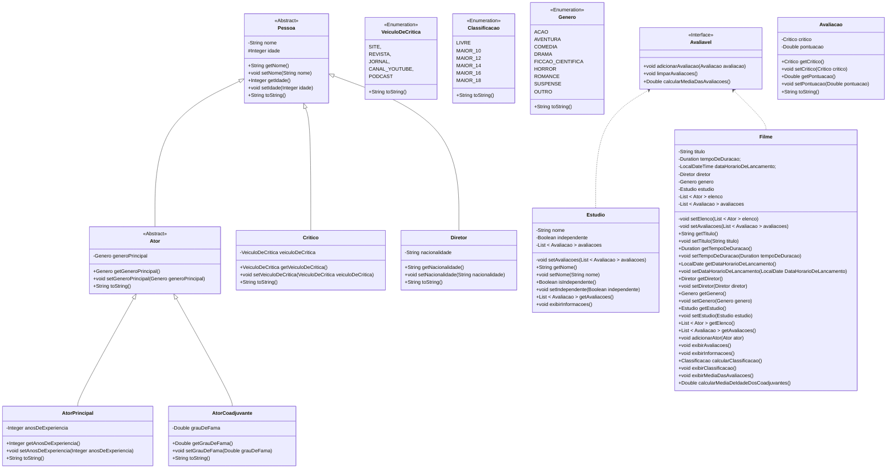

# Projeto Java: Sistema de gerenciamento de filmes

Este projeto Java tem como objetivo criar um sistema de gerenciamento de filmes, incorporando classes para atores, diretores, críticos e outras entidades, com ênfase em funcionalidades avançadas que aprimoram o sistema.

[Voltar](../../README.md)

# Índice

<!-- TOC -->

- [1. Descrição](#1-descri%C3%A7%C3%A3o)
- [2. Componentes](#2-componentes)
- [3. Requisitos](#3-requisitos)
- [4. Funcionalidades](#4-funcionalidades)
- [5. Exemplo de uso](#5-exemplo-de-uso)

<!-- /TOC -->

## 1. Descrição

Este projeto visa criar um sistema de gerenciamento de filmes em Java, abordando entidades essenciais do mundo cinematográfico, como Filmes, Diretores, Atores, Avaliações de Filmes, entre outros. O sistema oferece uma estrutura robusta para organização e manipulação de informações relacionadas aos filmes.

A implementação não se limita apenas à modelagem das classes, mas também prioriza a entrega de um conjunto de funcionalidades avançadas que enriquecem e aprimoram o sistema como um todo.

## 2. Componentes



## 3. Requisitos

Faça **validações**, garantindo que:

1. A idade dos diretores e críticos seja maior ou igual a **18** anos;
2. A idade dos atores seja maior ou igual a **5** anos. Para isso, sobrescreva o `setIdade` da superclasse;
3. O grau de fama dos atores coadjuvantes esteja dentro do intervalo de **0.0** a **10.0**;
4. A nacionalidade dos diretores não seja nula, vazia ou apenas espaços em branco;
5. O título dos filmes não seja nulo, vazio ou apenas espaços em branco;
6. O tempo de duração dos filmes seja positivo;
7. A data e horário de lançamento dos filmes seja anterior à data e horário atual;
8. O nome do estúdio dos filmes não seja nulo, vazio ou apenas espaços em branco;
9. A pontuação das avaliações dos filmes esteja dentro do intervalo de **0.0** a **10.0**;
10. A pontuação das avaliações dos estúdios esteja dentro do intervalo de **0.0** a **5.0**;
11. O atributo de independência dos estúdios seja um valor verdadeiro ou falso;
12. O número de anos de experiência dos atores principais seja positivo;
13. Cada filme possua pelo menos um diretor associado;
14. Cada filme possua pelo menos um ator principal;
15. Cada ator possua um nome exclusivo em um filme, sem repetições;

## 4. Funcionalidades

1. Implemente um método na classe **Filme** para calcular a classificação indicativa do filme com base na idade dos atores principais. Considere que a classificação indicativa será a menor entre as idades dos atores principais mais 5 anos. Por exemplo, se o filme tem um ator principal com 15 anos e outro com 30 anos, a classificação indicativa será de 20 anos.
2. Implemente um método na classe **Filme** para exibir as informações das avaliações do filme, incluindo o nome do crítico e a pontuação atribuída. Este método deve chamar o método `toString` da classe que compõem a avaliação.
3. Implemente um método na classe **Filme** para exibir a classificação indicativa do filme calculada pelo sistema.
4. Implemente um método na classe **Filme** para exibir a média das avaliações do filme com duas casas decimais.
5. Implemente um método na classe **Filme** para calcular a média de idade dos atores coadjuvantes associados a ele.

## 5. Exemplo de uso

```java
public class Main {
    public static void main(String[] args) {

        AtorPrincipal atorPrincipal1 = new AtorPrincipal("Jennifer Lawrence", 30, Genero.DRAMA, 10);
        AtorPrincipal atorPrincipal2 = new AtorPrincipal("Leonardo DiCaprio", 47, Genero.SUSPENSE, 25);

        AtorCoadjuvante atorCoadjuvante1 = new AtorCoadjuvante("Tom Holland", 25, Genero.AVENTURA, 9.5);
        AtorCoadjuvante atorCoadjuvante2 = new AtorCoadjuvante("Zendaya", 25, Genero.AVENTURA, 8.7);

        Diretor diretor = new Diretor("Christopher Nolan", 51, "Britânico");

        Estudio estudio = new Estudio("Warner Bros.", false);

        Filme filme = new Filme("Inception", Duration.ofMinutes(148), LocalDate.of(2010, 7, 16), diretor, Genero.SUSPENSE, estudio);
        filme.adicionarAtor(atorPrincipal1);
        filme.adicionarAtor(atorPrincipal2);
        filme.adicionarAtor(atorCoadjuvante1);
        filme.adicionarAtor(atorCoadjuvante2);

        Critico critico1 = new Critico("Roger Ebert", VeiculoDeCritica.JORNAL);
        Critico critico2 = new Critico("Peter Travers", VeiculoDeCritica.REVISTA);

        Avaliacao avaliacao1 = new Avaliacao(critico1, 9.0);
        Avaliacao avaliacao2 = new Avaliacao(critico2, 8.5);

        filme.adicionarAvaliacao(avaliacao1);
        filme.adicionarAvaliacao(avaliacao2);

        filme.exibirInformacoes();
        filme.exibirAvaliacoes();
        filme.exibirClassificacao();
        filme.exibirMediaDasAvaliacoes();
        System.out.println("Média de idade dos atores coadjuvantes: " + filme.calcularMediaDeIdadeDosCoadjuvantes());
    }
}

```

[Voltar](../../README.md)
