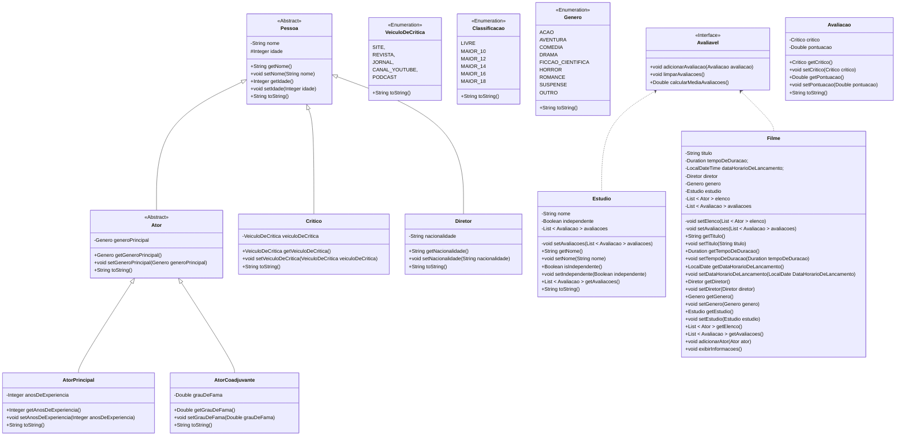

# Projeto Java: Sistema de gerenciamento de filmes

Este projeto Java tem como objetivo criar um sistema de gerenciamento de filmes, incorporando classes para atores, diretores, críticos e outras entidades, com ênfase em funcionalidades avançadas que aprimoram o sistema.

> ⚠ Sob construção

[Voltar](../../README.md)

# Índice

<!-- TOC -->

- [1. Descrição](#1-descri%C3%A7%C3%A3o)
- [2. Componentes](#2-componentes)
- [3. Requisitos](#3-requisitos)

<!-- /TOC -->

## 1. Descrição

Este projeto visa criar um sistema de gerenciamento de filmes em Java, abordando entidades essenciais do mundo cinematográfico, como Filmes, Diretores, Atores, Avaliações de Filmes, entre outros. O sistema oferece uma estrutura robusta para organização e manipulação de informações relacionadas aos filmes.

A implementação não se limita apenas à modelagem das classes, mas também prioriza a entrega de um conjunto de funcionalidades avançadas que enriquecem e aprimoram o sistema como um todo.

## 2. Componentes

## 3. Requisitos

Faça **validações**, garantindo que:

1. A idade dos diretores e críticos seja maior ou igual a **18** anos;
1. A idade dos atores seja maior ou igual a **5** anos. Para isso, sobrescreva o `setIdade` da superclasse;
1. O grau de fama dos atores coadjuvantes esteja dentro do intervalo de **0.0** a **10.0**;
1. A nacionalidade dos diretores não seja nula, vazia ou apenas espaços em branco;
1. O título dos filmes não seja nulo, vazio ou apenas espaços em branco;
1. O tempo de duração dos filmes seja positivo;
1. A data de lançamento dos filmes seja anterior ou igual à data atual;
1. O nome do estúdio dos filmes não seja nulo, vazio ou apenas espaços em branco;
1. A pontuação das avaliações dos filmes esteja dentro do intervalo de **0.0** a **10.0**;
1. O atributo de independência dos estúdios seja um valor verdadeiro ou falso;
1. O número de anos de experiência dos atores principais seja positivo;
1. Cada filme possua pelo menos um diretor associado;
1. Cada filme possua pelo menos um ator principal;
1. Cada estúdio possua um nome exclusivo, sem repetições;
1. Cada filme possua um título único, sem repetições;
1. Cada ator possua um nome exclusivo, sem repetições;
1. Cada diretor possua um nome exclusivo, sem repetições;

> ⚠ Sob construção

[Voltar](../../README.md)
