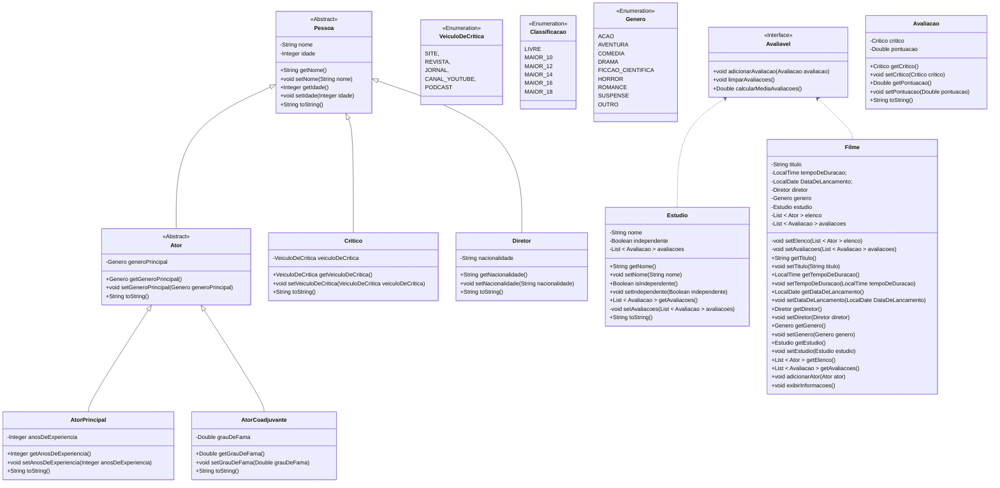

# Projeto Java: Sistema de gerenciamento de filmes

Este projeto Java tem como objetivo criar um sistema de gerenciamento de filmes, incorporando classes para atores, diretores, críticos e outras entidades, com ênfase em funcionalidades avançadas que aprimoram o sistema.

[Voltar](../../README.md)

# Índice

<!-- TOC -->

- [1. Descrição](#1-descri%C3%A7%C3%A3o)
- [2. Componentes](#2-componentes)

<!-- /TOC -->

## 1. Descrição

Este projeto visa criar um sistema de gerenciamento de filmes em Java, abordando entidades essenciais do mundo cinematográfico, como Filmes, Diretores, Atores, Avaliações de Filmes, entre outros. O sistema oferece uma estrutura robusta para organização e manipulação de informações relacionadas aos filmes.

A implementação não se limita apenas à modelagem das classes, mas também prioriza a entrega de um conjunto de funcionalidades avançadas que enriquecem e aprimoram o sistema como um todo.

## 2. Componentes

> ⚠ Sob construção

[Voltar](../../README.md)
