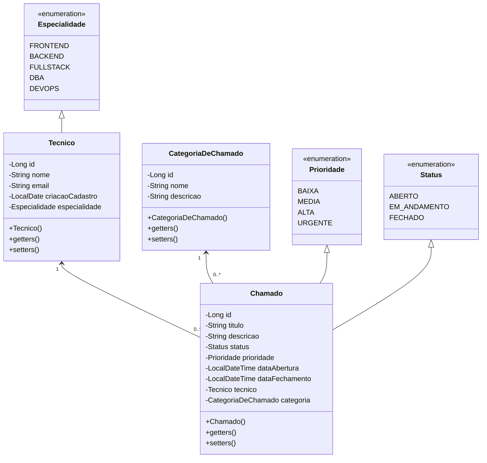

# Exercício Java: Gerenciando chamados

Este projeto Java tem como objetivo criar um sistema de controle de chamados, incorporando classes para técnicos, categorias de chamado e outras entidades, com ênfase em funcionalidades avançadas que aprimoram o sistema.

[Voltar](../../../README.md)

# Índice

<!-- TOC -->

- [1. Descrição](#1-descri%C3%A7%C3%A3o)
- [2. Configurações](#2-configura%C3%A7%C3%B5es)
- [3. Principais Componentes](#3-principais-componentes)
- [4. Estrutura do Projeto](#4-estrutura-do-projeto)
- [5. Validações](#5-valida%C3%A7%C3%B5es)
- [6. Entrada e Saída de Dados](#6-entrada-e-sa%C3%ADda-de-dados)
- [7. Endpoints e Métodos HTTP](#7-endpoints-e-m%C3%A9todos-http)

<!-- /TOC -->

## 1. Descrição

Este projeto tem como objetivo criar um sistema de controle de chamados em Java, abordando as principais entidades como **Chamados**, **Técnicos** e **Categorias de Chamado**. O sistema fornece uma estrutura organizada para gerenciar e manipular informações relacionadas aos chamados de forma eficiente.

## 2. Configurações

Seguem algumas configurações sugeridas:

**1. Dependências (`pom.xml`)**

- MySQL Driver
- Spring Boot DevTools
- Spring Data JPA
- Spring Web
- Validation

**2. `application.properties`**

```properties
spring.jpa.open-in-view=false
spring.datasource.username=root
spring.datasource.password=12345678
spring.jpa.hibernate.ddl-auto=update
spring.datasource.url=jdbc:mysql://localhost:3306/chamados?createDatabaseIfNotExist=true
```

## 3. Principais Componentes

A diagramação a seguir apresenta a estrutura dos principais componentes do sistema, incluindo principalmente as entidades.



## 4. Estrutura do Projeto

A estrutura do projeto é organizada para promover uma arquitetura clara e modular. Embora essa estrutura seja sugerida para facilitar a organização e a manutenção do código, não é obrigatório segui-la rigorosamente. Sinta-se à vontade para adaptá-la de acordo com suas necessidades e preferências.

```
src/main/java/com/group/demo
├── controller
│   ├── CategoriaDeChamadoController.java
│   ├── ChamadoController.java
│   └── TecnicoController.java
├── dto
│   ├── entrada
│   │   ├── CategoriaDeChamadoEntradaDTO.java
│   │   ├── ChamadoEntradaDTO.java
│   │   └── TecnicoEntradaDTO.java
│   └── saida
│       ├── detalhe
│       │   ├── CategoriaDeChamadoDetalheSaidaDTO.java
│       │   ├── ChamadoDetalheSaidaDTO.java
│       │   └── TecnicoDetalheSaidaDTO.java
│       └── resumo
│           ├── CategoriaDeChamadoResumoSaidaDTO.java
│           ├── ChamadoResumoSaidaDTO.java
│           └── TecnicoResumoSaidaDTO.java
├── enums
│   ├── Especialidade.java
│   ├── Prioridade.java
│   └── Status.java
├── model
│   ├── entity
│   │   ├── CategoriaDeChamado.java
│   │   ├── Chamado.java
│   │   └── Tecnico.java
│   └── repository
│       ├── CategoriaDeChamadoRepository.java
│       ├── ChamadoRepository.java
│       └── TecnicoRepository.java
├── service
│   ├── CategoriaDeChamadoService.java
│   ├── ChamadoService.java
│   └── TecnicoService.java
└── DemoApplication.java
```

## 5. Validações

Utilize anotações JPA para implementar restrições de validação automática nos atributos das entidades. Elas ajudarão a garantir que os dados sejam validados e armazenados corretamente, mantendo a integridade e a qualidade dos dados no sistema.

> [!TIP]
>
> Essas anotações podem ser encontradas no arquivo [jakarta.validation.constraints.md](../../../util/jakarta.validation.constraints.md).

> [!WARNING]
>
> Não esqueça de usar a anotação `@Valid` nos parâmetros das _controllers_ para que a validação funcione corretamente.

## 6. Entrada e Saída de Dados

Para garantir a organização e clareza na manipulação dos dados, o sistema utiliza três tipos de DTOs:

1. **DTO de Entrada (exemplo: `ItemEntradaDTO`)**: "Para a entrada de dados na API" - Este DTO é utilizado para a criação ou atualização de itens no sistema. Ele contém todos os atributos necessários, exceto o ID. _Exemplo de uso: ao enviar dados para criar um novo chamado, um técnico ou uma categoria de chamado_.

2. **DTO de Saída - Resumo (exemplo: `ItemResumoSaidaDTO`)**: "Para a saída de dados na API" - Utilizado para retornar uma lista de itens com informações resumidas. Este DTO contém apenas os atributos principais, necessários para exibir uma visão geral em listagens. _Exemplo de uso: retorno de uma lista de todos os chamados, técnicos ou categorias de chamado_.

3. **DTO de Saída - Detalhe (exemplo: `ItemDetalheSaidaDTO`)**: "Para a saída de dados na API" - Utilizado para retornar os detalhes completos de um item específico. Este DTO é utilizado quando se deseja visualizar ou manipular um item com profundidade, geralmente em endpoints que retornam um único item por ID. _Exemplo de uso: retorno dos detalhes completos de um chamado específico, técnico ou categoria de chamado_.

> **Resumo**
>
> - **Entrada de Dados**: Utilize o `ItemEntradaDTO` para enviar dados ao sistema, com todos os atributos necessários.
> - **Saída de Dados**:
>   - Para listagens, utilize o `ItemResumoSaidaDTO`, que retorna uma visão geral dos itens.
>   - Para detalhamentos, utilize o `ItemDetalheSaidaDTO`, que retorna todas as informações detalhadas de um item específico.

## 7. Endpoints e Métodos HTTP

A seguir estão os endpoints e métodos HTTP disponíveis para cada entidade no sistema, juntamente com os tipos de DTOs que eles recebem e retornam:

**Categoria de Chamado**

- **POST /categorias-de-chamado**: Cria uma nova categoria de chamado usando `CategoriaDeChamadoEntradaDTO` e retorna o objeto criado usando `CategoriaDeChamadoDetalheSaidaDTO`.
- **GET /categorias-de-chamado**: Retorna uma listagem de todas as categorias de chamado como um `Iterable` de `CategoriaDeChamadoResumoSaidaDTO`.
- **GET /categorias-de-chamado/{id}**: Retorna uma categoria de chamado específica com base no seu ID como um `CategoriaDeChamadoDetalheSaidaDTO`.
- **PUT /categorias-de-chamado/{id}**: Atualiza as informações de uma categoria de chamado existente com base no seu ID usando `CategoriaDeChamadoEntradaDTO` e retorna o objeto atualizado usando `CategoriaDeChamadoDetalheSaidaDTO`.
- **DELETE /categorias-de-chamado/{id}**: Remove uma categoria de chamado com base no seu ID e retorna o objeto removido usando `CategoriaDeChamadoDetalheSaidaDTO`.

**Chamado**

- **POST /chamados**: Cria um novo chamado usando `ChamadoEntradaDTO` e retorna o objeto criado usando `ChamadoDetalheSaidaDTO`.
- **GET /chamados**: Retorna uma listagem de todos os chamados como um `Iterable` de `ChamadoResumoSaidaDTO`.
- **GET /chamados/{id}**: Retorna um chamado específico com base no seu ID como um `ChamadoDetalheSaidaDTO`.
- **PUT /chamados/{id}**: Atualiza as informações de um chamado existente com base no seu ID usando `ChamadoEntradaDTO` e retorna o objeto atualizado usando `ChamadoDetalheSaidaDTO`.
- **DELETE /chamados/{id}**: Remove um chamado com base no seu ID e retorna o objeto removido usando `ChamadoDetalheSaidaDTO`.

**Técnico**

- **POST /tecnicos**: Cria um novo técnico usando `TecnicoEntradaDTO` e retorna o objeto criado usando `TecnicoDetalheSaidaDTO`.
- **GET /tecnicos**: Retorna uma listagem de todos os técnicos como um `Iterable` de TecnicoResumoSaidaDTO.
- **GET /tecnicos/{id}**: Retorna um técnico específico com base no seu ID como um `TecnicoDetalheSaidaDTO`.
- **PUT /tecnicos/{id}**: Atualiza as informações de um técnico existente com base no seu ID usando `TecnicoEntradaDTO` e retorna o objeto atualizado usando `TecnicoDetalheSaidaDTO`.
- **DELETE /tecnicos/{id}**: Remove um técnico com base no seu ID e retorna o objeto removido usando `TecnicoDetalheSaidaDTO`.

[Voltar](../../../README.md)
