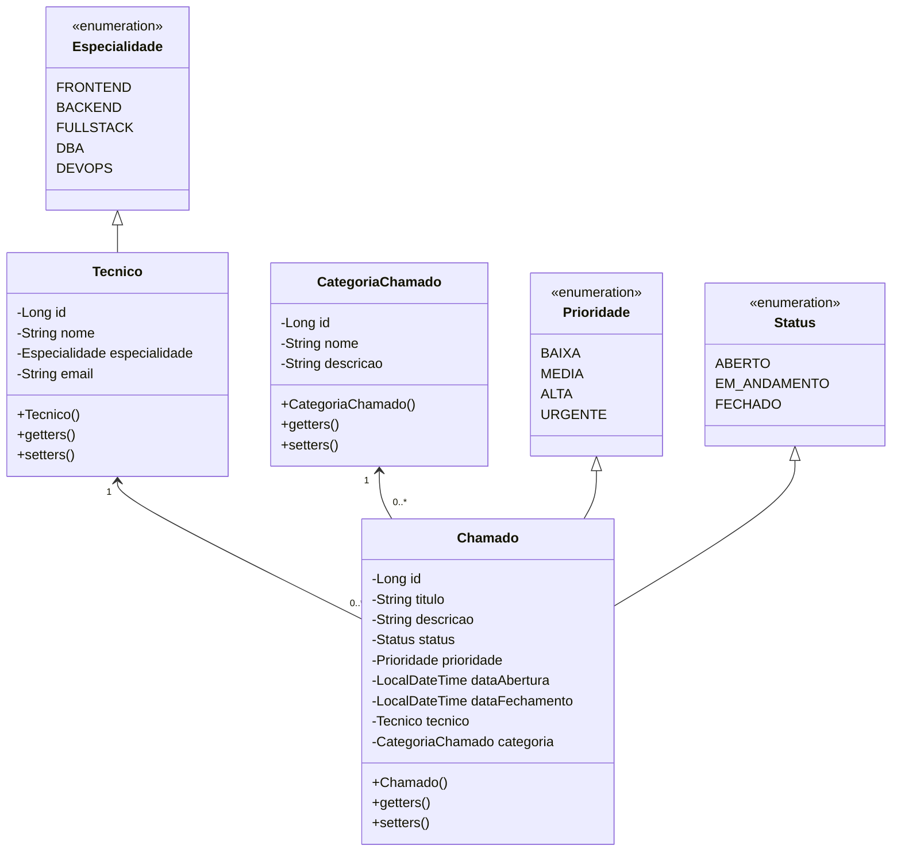

# Exercício Java: Gerenciando chamados

Este projeto Java tem como objetivo criar um sistema de controle de chamados, incorporando classes para técnicos, categorias de chamado e outras entidades, com ênfase em funcionalidades avançadas que aprimoram o sistema.

[Voltar](../../../README.md)

# Índice

<!-- TOC -->

- [1. Descrição](#1-descri%C3%A7%C3%A3o)
- [2. Componentes](#2-componentes)
- [3. Estrutura do Projeto](#3-estrutura-do-projeto)
- [4. Validações](#4-valida%C3%A7%C3%B5es)
- [5. Endpoints e Métodos HTTP](#5-endpoints-e-m%C3%A9todos-http)

<!-- /TOC -->

## 1. Descrição

Este projeto visa criar um sistema de controle de chamados em Java, abordando entidades essenciais como Chamados, Técnicos, e Categorias de Chamado. O sistema oferece uma estrutura robusta para a organização e manipulação de informações relacionadas aos chamados.

A implementação não se limita apenas à modelagem das classes, mas também prioriza a entrega de um conjunto de funcionalidades avançadas que enriquecem e aprimoram o sistema como um todo.

## 2. Componentes



## 3. Estrutura do Projeto

```
src/main/java/com/group/demo
├── controller
│   ├── CategoriaChamadoController.java
│   ├── ChamadoController.java
│   └── TecnicoController.java
├── enums
│   ├── Especialidade.java
│   ├── Prioridade.java
│   └── Status.java
├── model
│   ├── entity
│   │   ├── CategoriaChamado.java
│   │   ├── Chamado.java
│   │   └── Tecnico.java
│   └── repository
│       ├── CategoriaChamadoRepository.java
│       ├── ChamadoRepository.java
│       └── TecnicoRepository.java
├── service
│   ├── CategoriaChamadoService.java
│   ├── ChamadoService.java
│   └── TecnicoService.java
└── DemoApplication.java
```

## 4. Validações

Utilize anotações JPA para implementar restrições de validação automática nos atributos das entidades. Elas ajudarão a garantir que os dados sejam validados e armazenados corretamente, mantendo a integridade e a qualidade dos dados no sistema.

> [!TIP]
>
> Essas anotações podem ser encontradas no arquivo [jakarta.validation.constraints.md](../../../util/jakarta.validation.constraints.md).

> [!WARNING]
>
> Não esqueça de usar a anotação `@Valid` nos parâmetros das _controllers_ para que a validação funcione corretamente.

## 5. Endpoints e Métodos HTTP

A seguir estão os endpoints e métodos HTTP que devem estar disponíveis para cada entidade no sistema:

**Categoria de Chamado**

-   **GET /categorias-de-chamado**: Retorna uma lista de todas as categorias de chamado.
-   **GET /categorias-de-chamado/{id}**: Retorna uma categoria específica com base no seu ID.
-   **POST /categorias-de-chamado**: Cria uma nova categoria de chamado.
-   **PUT /categorias-de-chamado/{id}**: Atualiza as informações de uma categoria de chamado existente com base no seu ID.
-   **DELETE /categorias-de-chamado/{id}**: Remove uma categoria de chamado com base no seu ID.

**Chamado**

-   **GET /chamados**: Retorna uma lista de todos os chamados.
-   **GET /chamados/{id}**: Retorna um chamado específico com base no seu ID.
-   **POST /chamados**: Cria um novo chamado.
-   **PUT /chamados/{id}**: Atualiza as informações de um chamado existente com base no seu ID.
-   **DELETE /chamados/{id}**: Remove um chamado com base no seu ID.

**Técnico**

-   **GET /tecnicos**: Retorna uma lista de todos os técnicos.
-   **GET /tecnicos/{id}**: Retorna um técnico específico com base no seu ID.
-   **POST /tecnicos**: Cria um novo técnico.
-   **PUT /tecnicos/{id}**: Atualiza as informações de um técnico existente com base no seu ID.
-   **DELETE /tecnicos/{id}**: Remove um técnico com base no seu ID.

[Voltar](../../../README.md)
