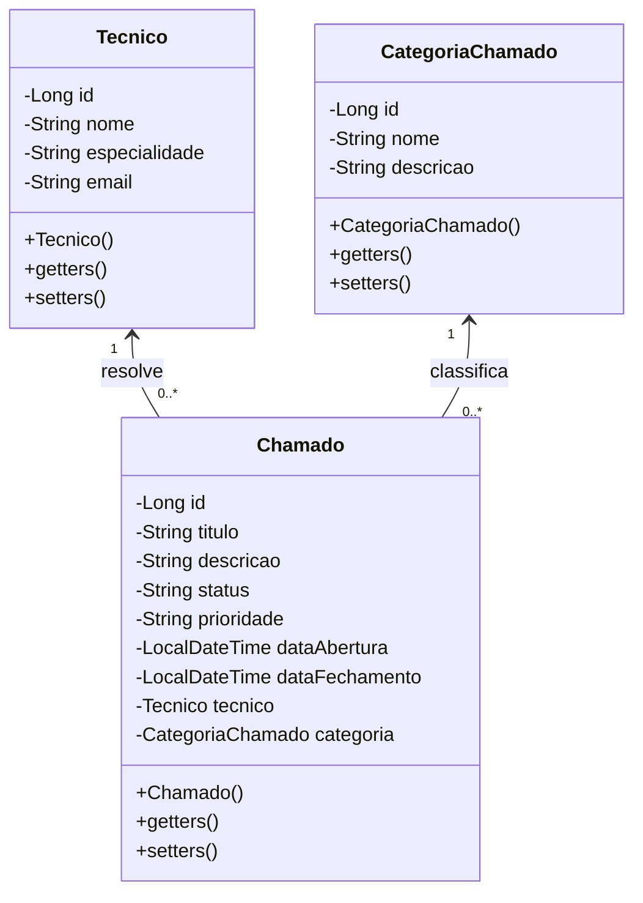

# Exercício Java: Gerenciando chamados

Este projeto Java tem como objetivo criar um sistema de controle de chamados, incorporando classes para técnicos, categorias de chamado e outras entidades, com ênfase em funcionalidades avançadas que aprimoram o sistema.

[Voltar](../../../README.md)

# Índice

<!-- TOC -->

- [1. Descrição](#1-descri%C3%A7%C3%A3o)
- [2. Componentes](#2-componentes)
- [3. Estrutura do Projeto](#3-estrutura-do-projeto)

<!-- /TOC -->

## 1. Descrição

Este projeto visa criar um sistema de controle de chamados em Java, abordando entidades essenciais como Chamados, Técnicos, e Categorias de Chamado. O sistema oferece uma estrutura robusta para a organização e manipulação de informações relacionadas aos chamados.

A implementação não se limita apenas à modelagem das classes, mas também prioriza a entrega de um conjunto de funcionalidades avançadas que enriquecem e aprimoram o sistema como um todo.

## 2. Componentes



## 3. Estrutura do Projeto

```
src/main/java/com/group/demo
├── controller
│   ├── ChamadoController.java
│   ├── TecnicoController.java
│   └── CategoriaChamadoController.java
├── model
│   ├── entity
│   │   ├── Chamado.java
│   │   ├── Tecnico.java
│   │   └── CategoriaChamado.java
│   └── repository
│       ├── ChamadoRepository.java
│       ├── TecnicoRepository.java
│       └── CategoriaChamadoRepository.java
├── service
│   ├── ChamadoService.java
│   ├── TecnicoService.java
│   └── CategoriaChamadoService.java
└── Application.java
```

[Voltar](../../../README.md)
