# Exercício Java: Gerenciando chamados

Este projeto Java tem como objetivo criar um sistema de controle de chamados, incorporando classes para técnicos, categorias de chamado e outras entidades, com ênfase em funcionalidades avançadas que aprimoram o sistema.

[Voltar](../../../README.md)

# Índice

<!-- TOC -->

- [1. Descrição](#1-descri%C3%A7%C3%A3o)
- [2. Configurações](#2-configura%C3%A7%C3%B5es)
- [3. Componentes](#3-componentes)
- [4. Estrutura do Projeto](#4-estrutura-do-projeto)
- [5. Validações](#5-valida%C3%A7%C3%B5es)
- [6. Endpoints e Métodos HTTP](#6-endpoints-e-m%C3%A9todos-http)

<!-- /TOC -->

## 1. Descrição

Este projeto tem como objetivo criar um sistema de controle de chamados em Java, abordando as principais entidades como **Chamados**, **Técnicos** e **Categorias de Chamado**. O sistema fornece uma estrutura organizada para gerenciar e manipular informações relacionadas aos chamados de forma eficiente.

## 2. Configurações

Seguem algumas configurações sugeridas:

**1. Dependências (`pom.xml`)**

- MySQL Driver
- Spring Boot DevTools
- Spring Data JPA
- Spring Web
- Validation

**2. `application.properties`**

```properties
spring.jpa.open-in-view=false
spring.datasource.username=root
spring.datasource.password=12345678
spring.jpa.hibernate.ddl-auto=update
spring.datasource.url=jdbc:mysql://localhost:3306/chamados?createDatabaseIfNotExist=true
```

## 3. Componentes

A diagramação a seguir apresenta a estrutura dos principais componentes do sistema, incluindo as classes e suas relações.

```mermaid
classDiagram

class Tecnico {
  -Long id
  -String nome
  -Especialidade especialidade
  -String email
  +Tecnico()
  +getters()
  +setters()
}

class CategoriaDeChamado {
  -Long id
  -String nome
  -String descricao
  +CategoriaDeChamado()
  +getters()
  +setters()
}

class Chamado {
  -Long id
  -String titulo
  -String descricao
  -Status status
  -Prioridade prioridade
  -LocalDateTime dataAbertura
  -LocalDateTime dataFechamento
  -Tecnico tecnico
  -CategoriaDeChamado categoria
  +Chamado()
  +getters()
  +setters()
}

class Especialidade {
    <<enumeration>>
    FRONTEND
    BACKEND
    FULLSTACK
    DBA
    DEVOPS
}

class Prioridade {
    <<enumeration>>
    BAIXA
    MEDIA
    ALTA
    URGENTE
}

class Status {
    <<enumeration>>
    ABERTO
    EM_ANDAMENTO
    FECHADO
}

Tecnico "1" <-- "0..*" Chamado
CategoriaDeChamado "1" <-- "0..*" Chamado

Especialidade <|-- Tecnico
Prioridade <|-- Chamado
Status <|-- Chamado
```



## 4. Estrutura do Projeto

A estrutura do projeto é organizada para promover uma arquitetura clara e modular. Embora essa estrutura seja sugerida para facilitar a organização e a manutenção do código, não é obrigatório segui-la rigorosamente. Sinta-se à vontade para adaptá-la de acordo com suas necessidades e preferências.

```
src/main/java/com/group/demo
├── controller
│   ├── CategoriaDeChamadoController.java
│   ├── ChamadoController.java
│   └── TecnicoController.java
├── enums
│   ├── Especialidade.java
│   ├── Prioridade.java
│   └── Status.java
├── model
│   ├── entity
│   │   ├── CategoriaDeChamado.java
│   │   ├── Chamado.java
│   │   └── Tecnico.java
│   └── repository
│       ├── CategoriaDeChamadoRepository.java
│       ├── ChamadoRepository.java
│       └── TecnicoRepository.java
├── service
│   ├── CategoriaDeChamadoService.java
│   ├── ChamadoService.java
│   └── TecnicoService.java
└── DemoApplication.java
```

## 5. Validações

Utilize anotações JPA para implementar restrições de validação automática nos atributos das entidades. Elas ajudarão a garantir que os dados sejam validados e armazenados corretamente, mantendo a integridade e a qualidade dos dados no sistema.

> [!TIP]
>
> Essas anotações podem ser encontradas no arquivo [jakarta.validation.constraints.md](../../../util/jakarta.validation.constraints.md).

> [!WARNING]
>
> Não esqueça de usar a anotação `@Valid` nos parâmetros das _controllers_ para que a validação funcione corretamente.

## 6. Endpoints e Métodos HTTP

A seguir estão os endpoints e métodos HTTP que devem estar disponíveis para cada entidade no sistema:

**Categoria de Chamado**

- **POST `/categorias-de-chamado`**: Cria uma nova categoria de chamado.
- **GET `/categorias-de-chamado`**: Retorna uma lista de todas as categorias de chamado.
- **GET `/categorias-de-chamado/{id}`**: Retorna uma categoria específica com base no seu ID.
- **PUT `/categorias-de-chamado/{id}`**: Atualiza as informações de uma categoria de chamado existente com base no seu ID.
- **DELETE `/categorias-de-chamado/{id}`**: Remove uma categoria de chamado com base no seu ID.

**Chamado**

- **POST `/chamados`**: Cria um novo chamado.
- **GET `/chamados`**: Retorna uma lista de todos os chamados.
- **GET `/chamados/{id}`**: Retorna um chamado específico com base no seu ID.
- **PUT `/chamados/{id}`**: Atualiza as informações de um chamado existente com base no seu ID.
- **DELETE `/chamados/{id}`**: Remove um chamado com base no seu ID.

**Técnico**

- **POST `/tecnicos`**: Cria um novo técnico.
- **GET `/tecnicos`**: Retorna uma lista de todos os técnicos.
- **GET `/tecnicos/{id}`**: Retorna um técnico específico com base no seu ID.
- **PUT `/tecnicos/{id}`**: Atualiza as informações de um técnico existente com base no seu ID.
- **DELETE `/tecnicos/{id}`**: Remove um técnico com base no seu ID.

[Voltar](../../../README.md)
