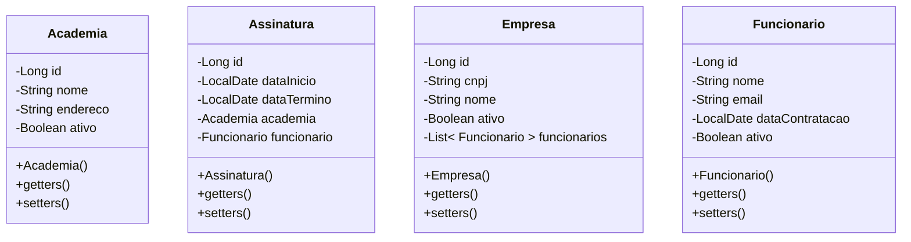

# Exercício Java: Movepass

<p align="center">
  <a href="#">
    
  </a>
</p>

Neste exercício, você desenvolverá uma API REST utilizando Java e Spring Boot, com foco na criação de um sistema simples chamado **Movepass**. Este sistema é inspirado no Gympass, e será utilizado para praticar conceitos de Programação Orientada a Objetos (POO), testes, Spring Boot, e boas práticas de desenvolvimento de software.

[Voltar](../../../README.md)

# Índice

<!-- TOC -->

- [1. Introdução](#1-introdu%C3%A7%C3%A3o)
- [2. Dependências](#2-depend%C3%AAncias)
  - [2.1. De aplicação](#21-de-aplica%C3%A7%C3%A3o)
  - [2.2. De desenvolvimento](#22-de-desenvolvimento)
  - [2.3. De teste](#23-de-teste)
  - [2.4. De documentação](#24-de-documenta%C3%A7%C3%A3o)
- [3. Configurações](#3-configura%C3%A7%C3%B5es)
- [4. Entidades](#4-entidades)
- [5. Requisitos](#5-requisitos)
- [6. Estrutura do projeto](#6-estrutura-do-projeto)
- [7. Validações](#7-valida%C3%A7%C3%B5es)
- [8. Endpoints](#8-endpoints)
- [9. Conclusão](#9-conclus%C3%A3o)

<!-- /TOC -->

## 1. Introdução

O projeto **Movepass** consiste em uma API REST que simula a gestão de academias, empresas e assinaturas de funcionários. A ideia central é permitir que empresas possam cadastrar seus funcionários em academias, gerenciando assinaturas e possibilitando que esses funcionários utilizem as academias parceiras.

Você precisará implementar quatro principais entidades: Empresa, Funcionário, Academia e Assinatura. A regra de negócio básica é que uma empresa pode ter múltiplos funcionários, cada funcionário pode ter uma assinatura em uma ou mais academias, e cada academia pode ter vários funcionários assinantes.

## 2. Dependências

Dependências de um projeto são bibliotecas externas ou módulos que o projeto precisa para funcionar corretamente, como frameworks, APIs ou ferramentas de suporte. Elas podem ser gerenciadas automaticamente por ferramentas como Maven, que baixam, atualizam e integram essas dependências ao projeto conforme especificado na configuração do build.

> [!IMPORTANT]
> Adicione as dependências de **`aplicação`**, **`desenvolvimento`** e **`teste`** no _Spring Initializr_ ao criar o projeto. Para as de **`documentação`**, adicione manualmente no `pom.xml`, pois, neste caso, a dependência requisitada não está disponível no _Spring Initializr_.

### 2.1. De aplicação

Dependências de aplicação são bibliotecas necessárias para a execução do software em produção, como frameworks e APIs essenciais para as funcionalidades principais.

- **MySQL Driver**: Driver JDBC para conectar o Spring Boot a um banco de dados MySQL.
- **Spring Data JPA**: Abstração do Spring sobre o JPA para simplificar o acesso e manipulação de dados em bancos de dados relacionais.
- **Spring Web**: Dependência que inclui suporte para o desenvolvimento de aplicações web, incluindo RESTful APIs.
- **Validation**: Suporte para validação de dados utilizando Jakarta Bean Validation (antigo Java Bean Validation).

### 2.2. De desenvolvimento

Dependências de desenvolvimento são ferramentas e bibliotecas usadas apenas durante o desenvolvimento do projeto, como linters, geradores de código ou plugins de integração.

- **Lombok**: Biblioteca que reduz o código boilerplate em classes. Através de simples anotações, gera métodos como getters, setters, equals, hashCode, toString, construtores e mais.
- **Spring Boot DevTools**: Ferramentas de desenvolvimento para acelerar o ciclo de feedback durante o desenvolvimento, como reinicialização automática e live reload.

### 2.3. De teste

Dependências de teste são bibliotecas usadas para escrever e executar testes automatizados, como frameworks de testes unitários, mocks ou ferramentas de cobertura de código.

- **H2 Database**: Banco de dados em memória utilizado para testes, útil por ser leve e de fácil configuração.
- **Spring Boot Starter Test**: Framework de teste para escrever e executar testes unitários e de integração (já incluso por padrão ao gerar um projeto via Spring Initializr).

### 2.4. De documentação

Dependências de documentação são ferramentas utilizadas para gerar, gerenciar e publicar a documentação do projeto, como geradores de documentação a partir de comentários no código ou ferramentas de formatação de documentos.

- **OpenAPI**: Biblioteca para gerar e expor a documentação da API REST. Permite visualizar e interagir com a API de forma gráfica através de uma interface web implementada pelo Swagger. Por padrão, a documentação fica disponível em `GET /swagger-ui`.

  ```xml
   <dependency>
      <groupId>org.springdoc</groupId>
      <artifactId>springdoc-openapi-starter-webmvc-ui</artifactId>
      <version>2.6.0</version>
   </dependency>
  ```

  > :bulb: **Tip:** No próximo passo, usaremos uma configuração para que seja possível acessar a página do Swagger também através do endpoint `GET /docs`

## 3. Configurações

Estas configurações definem a conexão com o banco de dados MySQL, as credenciais de acesso e as propriedades do JPA para o projeto Movepass. Incluem parâmetros essenciais para garantir a persistência dos dados e o comportamento adequado da aplicação durante a execução. Insira esses valores no arquivo `application.properties`:

```properties
spring.jpa.open-in-view=false
springdoc.swagger-ui.path=/docs
spring.datasource.username=root
spring.datasource.password=12345678
spring.jpa.hibernate.ddl-auto=update
spring.datasource.url=jdbc:mysql://localhost:3306/movepass?createDatabaseIfNotExist=true
```

## 4. Entidades

As entidades do projeto Movepass representam os principais elementos do sistema, como Empresa, Funcionário, Academia e Assinatura. Abaixo está uma representação das classes dessas entidades:



## 5. Requisitos

Requisitos que devem ser seguidos ao implementar o exercício:

1. Certifique-se de que a lógica de soft delete seja implementada de forma consistente, filtrando registros inativos em qualquer consulta. **Soft delete** consiste na exclusão lógica de registros no banco de dados. Em vez de remover os registros fisicamente, um campo booleano (neste caso o campo `ativo`) será utilizado para indicar se o registro está ativo ou inativo.

2. As respostas da API podem utilizar as próprias entidades, embora seja recomendado usar DTOs de saída. Para as entradas, deve-se usar DTOs de entrada, solicitando apenas os dados necessários do cliente da aplicação.

3. Utilize anotações para melhorar a visualização da documentação no Swagger UI, como:

   - Anotar o classe controladora com `@Tag(name = "Nome do grupo de endpoints", description = "Descrição do grupo de endpoints")` (_io.swagger.v3.oas.annotations.tags.Tag_);
   - Anotar cada método da classe controladora com `@Operation(summary = "Resumo da operação", description = "Descrição detalhada da operação")` (_io.swagger.v3.oas.annotations.Operation_).

4. Lance exceções personalizadas quando necessário e capture-as na camada de controle usando um método anotado com `@ExceptionHandler(ClasseException.class)` (_org.springframework.web.bind.annotation.ExceptionHandler_).

5. Padronize todas as respostas das classes controladoras usando `ResponseEntity<Classe>` (_org.springframework.http.ResponseEntity_). Lembre-se de usar os códigos de status corretamente para cada método (vide [MOZILLA, Códigos de status de respostas HTTP](https://developer.mozilla.org/pt-BR/docs/Web/HTTP/Status)). Para facilitar, faça uso do enum `HttpStatus` (_org.springframework.http.HttpStatus_).

## 6. Estrutura do projeto

A estrutura do projeto Movepass segue uma organização modular, separando as responsabilidades de cada camada do sistema. Isso facilita a manutenção e a escalabilidade do código. Abaixo está a estrutura sugerida:

```text
src/main/java/com/movepass
├─── controller
│    ├─── AcademiaController.java
│    ├─── AssinaturaController.java
│    ├─── EmpresaController.java
│    └─── FuncionarioController.java
├─── dto
│    ├─── AcademiaDTO.java
│    ├─── AssinaturaDTO.java
│    ├─── EmpresaDTO.java
│    └─── FuncionarioDTO.java
├─── exception
│    └─── RegistroInexistenteException.java
├─── model
│    ├─── entity
│    │    ├─── Academia.java
│    │    ├─── Assinatura.java
│    │    ├─── Empresa.java
│    │    └─── Funcionario.java
│    └─── repository
│         ├─── AcademiaRepository.java
│         ├─── AssinaturaRepository.java
│         ├─── EmpresaRepository.java
│         └─── FuncionarioRepository.java
├─── service
│    ├─── AcademiaService.java
│    ├─── AssinaturaService.java
│    ├─── EmpresaService.java
│    └─── FuncionarioService.java
└─── MovepassApplication.java


src/test/java/com/movepass
└─── controller
     ├─── AcademiaControllerTest.java
     ├─── AssinaturaControllerTest.java
     ├─── EmpresaControllerTest.java
     └─── FuncionarioControllerTest.java
```

## 7. Validações

Utilize **Jakarta Constraints** para validar os dados recebidos do cliente. Por exemplo:

- **Funcionário**:

  - Nome (não nulo e com tamanho mínimo de 3 caracteres).
  - Email (não nulo e no formato correto).

- **Empresa**:

  - Nome da empresa (não nulo e com tamanho mínimo de 3 caracteres).
  - CNPJ (não nulo e no formato correto).

- **Academia**:

  - Nome da academia (não nulo e com tamanho mínimo de 3 caracteres).
  - Endereço (não nulo).

- **Assinatura**:

  - Data de início (não nula e não pode ser no passado).
  - Data de término (deve ser posterior à data de início).
  - Academia (não nula).

> [!TIP]
>
> As anotações para validação podem ser encontradas no arquivo [jakarta.validation.constraints.md](../../../util/jakarta.validation.constraints.md).

> [!WARNING]
>
> Não esqueça de usar a anotação `@Valid` (_jakarta.validation.Valid_) nos parâmetros das _controllers_ para que as validações funcionem corretamente.

## 8. Endpoints

Crie endpoints para realizar as operações básicas de CRUD (Create, Read, Update, Delete) para cada entidade. Cada endpoint deve seguir o padrão RESTful, utilizando os métodos HTTP adequados:

- **Academia**

  - `POST /academias`: Criar nova academia.
  - `GET /academias`: Listar todas as academias.
  - `GET /academias/{id}`: Obter detalhes de uma academia específica.
  - `PUT /academias/{id}`: Atualizar dados de uma academia.
  - `DELETE /academias/{id}`: Inativar uma academia (soft delete).

- **Assinatura**

  - `POST /assinaturas`: Criar nova assinatura.
  - `GET /assinaturas`: Listar todas as assinaturas.
  - `GET /assinaturas/{id}`: Obter detalhes de uma assinatura específica.
  - `PUT /assinaturas/{id}`: Atualizar dados de uma assinatura.

- **Empresa**

  - `POST /empresas`: Criar nova empresa.
  - `GET /empresas`: Listar todas as empresas.
  - `GET /empresas/{id}`: Obter detalhes de uma empresa específica.
  - `PUT /empresas/{id}`: Atualizar dados de uma empresa.
  - `DELETE /empresas/{id}`: Inativar uma empresa (soft delete).

- **Funcionário**

  - `POST /funcionarios`: Criar novo funcionário.
  - `GET /funcionarios`: Listar todos os funcionários.
  - `GET /funcionarios/{id}`: Obter detalhes de um funcionário específico.
  - `PUT /funcionarios/{id}`: Atualizar dados de um funcionário.
  - `DELETE /funcionarios/{id}`: Inativar um funcionário (soft delete).

## 9. Conclusão

Ao concluir o desenvolvimento do projeto **Movepass**, você terá criado uma API REST funcional para a gestão de academias e assinaturas, utilizando Java e Spring Boot. Este exercício ofereceu uma ótima oportunidade para praticar conceitos importantes de Programação Orientada a Objetos, além de testes e boas práticas de desenvolvimento de software. A implementação de soft delete e as validações com Jakarta Constraints garantem uma boa gestão dos dados e a integridade das informações.

A estrutura modular do projeto, com suas entidades, serviços e controllers bem definidos, facilita a manutenção e a escalabilidade do sistema. Este projeto não só aprimorou suas habilidades técnicas, mas também ofereceu uma experiência prática valiosa no desenvolvimento de APIs.

[Voltar](../../../README.md)
